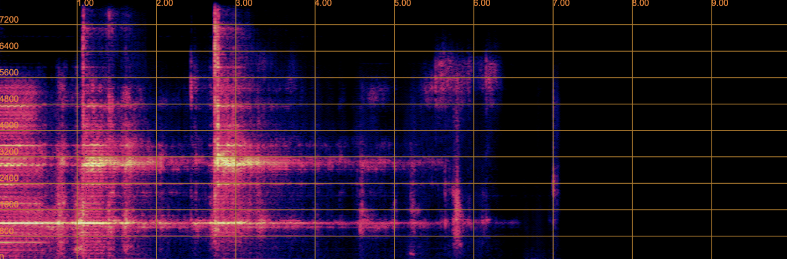
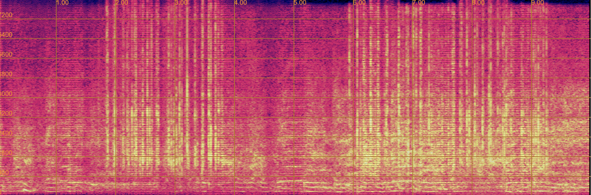
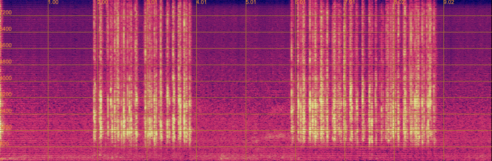

# 
 UniSep: Universal Target Audio Separation with Language Models at Scale 

 anonymous 

## Abstract
We propose Universal target audio Separation (UniSep), addressing the separation task on arbitrary mixtures of different types of audio. Distinguished from previous studies, UniSep is performed on unlimited source domains and unlimited source numbers. Amid the rapid expansion of the modeling space, a large language model (LLM) is deployed by predicting next token conditioned on the universal mixtures, leveraging the power of LLM in handling complex tasks with large-scale data. Moreover, a novel pre-training strategy is proposed to utilize large-scale audio data, which reduces the efforts of large-scale data simulation. We demonstrate the effectiveness of scaling dataset in an audio separation task: we use large-scale data (36.5k hours), including speech, music and sound, to train a universal target audio separation model that is not limited to a specific domain. Experiments indicate that separated samples show competitive subjective evaluation results compared with single-task models.

## Method

In the following, we will present some samples generated using our proposed UniSep.

## Target Speaker Extraction / Target Speech Separation
We should not only focus on the timbre, but also ensure the correctness of the speech content.

| 
 Mixture 
 | 
 Prompt 
 | 
 single w/o pre 
| 
 single w/ pre 
| 
 UniSep w/o pre 
| 
 UniSep w/ pre 
| 
 Target 
|
| -------------------------- | ------------------------- | ------------------------- | ------------------------------ | ----------------------------- | ---------------------------- | --------------------------- |
| <audio src="speech/mix/Spex_2094-142345-0054_61-70970-0034.wav" controls preload></audio> | <audio src="speech/prompt/Spex_2094-142345-0054_61-70970-0034.wav" controls preload></audio> |    <audio src="speech/v1/Spex_2094-142345-0054_61-70970-0034.wav" controls preload></audio> |    <audio src="speech/v2/Spex_2094-142345-0054_61-70970-0034.wav" controls preload></audio> |    <audio src="speech/v3/Spex_2094-142345-0054_61-70970-0034.wav" controls preload></audio> |    <audio src="speech/v4/Spex_2094-142345-0054_61-70970-0034.wav" controls preload></audio> |    <audio src="speech/GT/Spex_2094-142345-0054_61-70970-0034.wav" controls preload></audio> |
| <audio src="speech/mix/Spex_237-126133-0003_2830-3980-0028.wav" controls preload></audio> | <audio src="speech/prompt/Spex_237-126133-0003_2830-3980-0028.wav" controls preload></audio> |    <audio src="speech/v1/Spex_237-126133-0003_2830-3980-0028.wav" controls preload></audio> |    <audio src="speech/v2/Spex_237-126133-0003_2830-3980-0028.wav" controls preload></audio> |    <audio src="speech/v3/Spex_237-126133-0003_2830-3980-0028.wav" controls preload></audio> |    <audio src="speech/v4/Spex_237-126133-0003_2830-3980-0028.wav" controls preload></audio> |    <audio src="speech/GT/Spex_237-126133-0003_2830-3980-0028.wav" controls preload></audio> |
| <audio src="speech/mix/Spex_1221-135767-0005_61-70970-0020.wav" controls preload></audio> | <audio src="speech/prompt/Spex_1221-135767-0005_61-70970-0020.wav" controls preload></audio> | <audio src="speech/v1/Spex_1221-135767-0005_61-70970-0020.wav" controls preload></audio> | <audio src="speech/v2/Spex_1221-135767-0005_61-70970-0020.wav" controls preload></audio> | <audio src="speech/v3/Spex_1221-135767-0005_61-70970-0020.wav" controls preload></audio> | <audio src="speech/v4/Spex_1221-135767-0005_61-70970-0020.wav" controls preload></audio> | <audio src="speech/GT/Spex_1221-135767-0005_61-70970-0020.wav" controls preload></audio> |
| <audio src="speech/mix/Spex_61-70968-0004_1188-133604-0014.wav" controls preload></audio> | <audio src="speech/prompt/Spex_61-70968-0004_1188-133604-0014.wav" controls preload></audio> | <audio src="speech/v1/Spex_61-70968-0004_1188-133604-0014.wav" controls preload></audio> | <audio src="speech/v2/Spex_61-70968-0004_1188-133604-0014.wav" controls preload></audio> | <audio src="speech/v3/Spex_61-70968-0004_1188-133604-0014.wav" controls preload></audio> | <audio src="speech/v4/Spex_61-70968-0004_1188-133604-0014.wav" controls preload></audio> | <audio src="speech/GT/Spex_61-70968-0004_1188-133604-0014.wav" controls preload></audio> |
| <audio src="speech/mix/Spex_121-127105-0005_8455-210777-0039.wav" controls preload></audio> | <audio src="speech/prompt/Spex_121-127105-0005_8455-210777-0039.wav" controls preload></audio> | <audio src="speech/v1/Spex_121-127105-0005_8455-210777-0039.wav" controls preload></audio> | <audio src="speech/v2/Spex_121-127105-0005_8455-210777-0039.wav" controls preload></audio> | <audio src="speech/v3/Spex_121-127105-0005_8455-210777-0039.wav" controls preload></audio> | <audio src="speech/v4/Spex_121-127105-0005_8455-210777-0039.wav" controls preload></audio> | <audio src="speech/GT/Spex_121-127105-0005_8455-210777-0039.wav" controls preload></audio> |
| <audio src="speech/mix/Spex_1995-1826-0017_1284-134647-0001.wav" controls preload></audio> | <audio src="speech/prompt/Spex_1995-1826-0017_1284-134647-0001.wav" controls preload></audio> | <audio src="speech/v1/Spex_1995-1826-0017_1284-134647-0001.wav" controls preload></audio> | <audio src="speech/v2/Spex_1995-1826-0017_1284-134647-0001.wav" controls preload></audio> | <audio src="speech/v3/Spex_1995-1826-0017_1284-134647-0001.wav" controls preload></audio> | <audio src="speech/v4/Spex_1995-1826-0017_1284-134647-0001.wav" controls preload></audio> | <audio src="speech/GT/Spex_1995-1826-0017_1284-134647-0001.wav" controls preload></audio> |

## Target Sound Separation

### AudioSet

| 
 Mixture 
 | 
 Prompt 
 | 
 single w/o pre 
| 
 single w/ pre 
| 
 UniSep w/o pre 
| 
 UniSep w/ pre 
| 
 Target 
|
| -------------------------- | ------------------------- | ------------------------- | ------------------------------ | ----------------------------- | ---------------------------- | --------------------------- |
| <audio src="sound/mix/1.wav" controls preload></audio> | <audio src="sound/prompt/1.wav" controls preload></audio> | <audio src="sound/v1/1.wav" controls preload></audio> | <audio src="sound/v2/1.wav" controls preload></audio> | <audio src="sound/v3/1.wav" controls preload></audio> | <audio src="sound/v4/1.wav" controls preload></audio> | <audio src="sound/GT/1.wav" controls preload></audio> |
| <audio src="sound/mix/4.wav" controls preload></audio> | <audio src="sound/prompt/4.wav" controls preload></audio> | <audio src="sound/v1/4.wav" controls preload></audio> | <audio src="sound/v2/4.wav" controls preload></audio> | <audio src="sound/v3/4.wav" controls preload></audio> | <audio src="sound/v4/4.wav" controls preload></audio> | <audio src="sound/GT/4.wav" controls preload></audio> |
| <audio src="sound/mix/8.wav" controls preload></audio> | <audio src="sound/prompt/8.wav" controls preload></audio> | <audio src="sound/v1/8.wav" controls preload></audio> | <audio src="sound/v2/8.wav" controls preload></audio> | <audio src="sound/v3/8.wav" controls preload></audio> | <audio src="sound/v4/8.wav" controls preload></audio> | <audio src="sound/GT/8.wav" controls preload></audio> |
| <audio src="sound/mix/13.wav" controls preload></audio> | <audio src="sound/prompt/13.wav" controls preload></audio> | <audio src="sound/v1/13.wav" controls preload></audio> | <audio src="sound/v2/13.wav" controls preload></audio> | <audio src="sound/v3/13.wav" controls preload></audio> | <audio src="sound/v4/13.wav" controls preload></audio> | <audio src="sound/GT/13.wav" controls preload></audio> |
| <audio src="sound/mix/14.wav" controls preload></audio> | <audio src="sound/prompt/14.wav" controls preload></audio> | <audio src="sound/v1/14.wav" controls preload></audio> | <audio src="sound/v2/14.wav" controls preload></audio> | <audio src="sound/v3/14.wav" controls preload></audio> | <audio src="sound/v4/14.wav" controls preload></audio> | <audio src="sound/GT/14.wav" controls preload></audio> |
| <audio src="sound/mix/15.wav" controls preload></audio> | <audio src="sound/prompt/15.wav" controls preload></audio> | <audio src="sound/v1/15.wav" controls preload></audio> | <audio src="sound/v2/15.wav" controls preload></audio> | <audio src="sound/v3/15.wav" controls preload></audio> | <audio src="sound/v4/15.wav" controls preload></audio> | <audio src="sound/GT/15.wav" controls preload></audio> |

### ESC-50

| 
 Mixture 
 | 
 Prompt 
 | 
 UniSep w/ pre 
| 
 Target 
|
| -------------------------- | ------------------------- | ------------------------- |--------------------------- |
| <audio src="ESC-50/mix/Spex_test_14.wav" controls preload></audio> | <audio src="ESC-50/prompt/Spex_test_14.wav" controls preload></audio> | <audio src="ESC-50/v4/Spex_test_14.wav" controls preload></audio> | <audio src="ESC-50/GT/Spex_test_14.wav" controls preload></audio> |
| <audio src="ESC-50/mix/Spex_test_17.wav" controls preload></audio> | <audio src="ESC-50/prompt/Spex_test_17.wav" controls preload></audio> | <audio src="ESC-50/v4/Spex_test_17.wav" controls preload></audio> | <audio src="ESC-50/GT/Spex_test_17.wav" controls preload></audio> |
| <audio src="ESC-50/mix/Spex_test_30.wav" controls preload></audio> | <audio src="ESC-50/prompt/Spex_test_30.wav" controls preload></audio> | <audio src="ESC-50/v4/Spex_test_30.wav" controls preload></audio> | <audio src="ESC-50/GT/Spex_test_30.wav" controls preload></audio> |
| <audio src="ESC-50/mix/Spex_test_83.wav" controls preload></audio> | <audio src="ESC-50/prompt/Spex_test_83.wav" controls preload></audio> | <audio src="ESC-50/v4/Spex_test_83.wav" controls preload></audio> | <audio src="ESC-50/GT/Spex_test_83.wav" controls preload></audio> |
| <audio src="ESC-50/mix/Spex_test_115.wav" controls preload></audio> | <audio src="ESC-50/prompt/Spex_test_115.wav" controls preload></audio> | <audio src="ESC-50/v4/Spex_test_115.wav" controls preload></audio> | <audio src="ESC-50/GT/Spex_test_115.wav" controls preload></audio> |

## Target Music Separation

| 
 Mixture 
 | 
 Prompt 
 | 
 single w/o pre 
| 
 single w/ pre 
| 
 UniSep w/o pre 
| 
 UniSep w/ pre 
| 
 Target 
|
| -------------------------- | ------------------------- | ------------------------- | ------------------------------ | ----------------------------- | ---------------------------- | --------------------------- |
| <audio src="music/music_bass/mix/Spex_MUSDB_14.wav.wav" controls preload></audio> | <audio src="music/music_bass/prompt/Spex_MUSDB_14.wav.wav" controls preload></audio> | <audio src="music/music_bass/v1/Spex_MUSDB_14.wav.wav" controls preload></audio> | <audio src="music/music_bass/v2/Spex_MUSDB_14.wav.wav" controls preload></audio> | <audio src="music/music_bass/v3/Spex_MUSDB_14.wav.wav" controls preload></audio> | <audio src="music/music_bass/v4/Spex_MUSDB_14.wav.wav" controls preload></audio> | <audio src="music/music_bass/GT/Spex_MUSDB_14.wav.wav" controls preload></audio> |
| <audio src="music/music_drums/mix/Spex_MUSDB_13.wav.wav" controls preload></audio> | <audio src="music/music_drums/prompt/Spex_MUSDB_13.wav.wav" controls preload></audio> | <audio src="music/music_drums/v1/Spex_MUSDB_13.wav.wav" controls preload></audio> | <audio src="music/music_drums/v2/Spex_MUSDB_13.wav.wav" controls preload></audio> | <audio src="music/music_drums/v3/Spex_MUSDB_13.wav.wav" controls preload></audio> | <audio src="music/music_drums/v4/Spex_MUSDB_13.wav.wav" controls preload></audio> | <audio src="music/music_drums/GT/Spex_MUSDB_13.wav.wav" controls preload></audio> |
| <audio src="music/music_drums/mix/Spex_MUSDB_170.wav.wav" controls preload></audio> | <audio src="music/music_drums/prompt/Spex_MUSDB_170.wav.wav" controls preload></audio> | <audio src="music/music_drums/v1/Spex_MUSDB_170.wav.wav" controls preload></audio> | <audio src="music/music_drums/v2/Spex_MUSDB_170.wav.wav" controls preload></audio> | <audio src="music/music_drums/v3/Spex_MUSDB_170.wav.wav" controls preload></audio> | <audio src="music/music_drums/v4/Spex_MUSDB_170.wav.wav" controls preload></audio> | <audio src="music/music_drums/GT/Spex_MUSDB_170.wav.wav" controls preload></audio> |
| <audio src="music/music_other/mix/Spex_MUSDB_23.wav.wav" controls preload></audio> | <audio src="music/music_other/prompt/Spex_MUSDB_23.wav.wav" controls preload></audio> | <audio src="music/music_other/v1/Spex_MUSDB_23.wav.wav" controls preload></audio> | <audio src="music/music_other/v2/Spex_MUSDB_23.wav.wav" controls preload></audio> | <audio src="music/music_other/v3/Spex_MUSDB_23.wav.wav" controls preload></audio> | <audio src="music/music_other/v4/Spex_MUSDB_23.wav.wav" controls preload></audio> | <audio src="music/music_other/GT/Spex_MUSDB_23.wav.wav" controls preload></audio> |
| <audio src="music/music_vocals/mix/Spex_MUSDB_148.wav.wav" controls preload></audio> | <audio src="music/music_vocals/prompt/Spex_MUSDB_148.wav.wav" controls preload></audio> | <audio src="music/music_vocals/v1/Spex_MUSDB_148.wav.wav" controls preload></audio> | <audio src="music/music_vocals/v2/Spex_MUSDB_148.wav.wav" controls preload></audio> | <audio src="music/music_vocals/v3/Spex_MUSDB_148.wav.wav" controls preload></audio> | <audio src="music/music_vocals/v4/Spex_MUSDB_148.wav.wav" controls preload></audio> | <audio src="music/music_vocals/GT/Spex_MUSDB_148.wav.wav" controls preload></audio> |

## Downstream Task: language-queried audio source separation
Our trained UniSep can be fine-tuned using a smal amount of data to accomplish other tasks, e.g. language-queried audio source separation task. We show that UniSep can be fine-tuned on 50 hours text-audio pairs, then it can be used to separate audio based on text description. 
We utilize T5 for encoding the text description. In the table below, the text description is composed of two audio descriptions that form the mixed audio. 
The red font highlights the target audio description we aim to extract from it.

'Baseline' represents training from scratch and "fine-tuning" represents fine-tuning on our UniSep model.
'AudioSep' is from the model of "Separate Anything You Describe". 

Please note that AudioSep is trained on a massive dataset of 14,000 hours of audio-text pairs, including AudioSet, VGGSound, AudioCaps, Clotho v2, and WavCaps. 
In contrast, our UniSep is fine-tuned on a much smaller dataset of only around 16.7 hours from the AudioCaps dataset.
Despite being fine-tuned on a considerably smaller dataset, UniSep is still able to achieve competitive results in audio separation tasks.
This demonstrates UniSep's potential for fine-tuning on a smaller dataset to achieve competitive performance in audio separation tasks.

| 
 Mixture 
 | 
 Text description 
 | 
 baseline 
| 
 AudioSep 
| 
 fine-tuning(ours)
| 
 Target 
|
| -------------------------- | ------------------------- | ------------------------- | ------------------------------ | ----------------------------- | ----------------------------- |
|    <audio src="languaga-based_separation/mix/computer.wav" controls preload></audio>  | **' Typing on a computer keyboard '** + ' The rain pours, and a man talks ' |    <audio src="languaga-based_separation/baseline/computer.wav" controls preload></audio> |    <audio src="languaga-based_separation/AudioSep/computer.wav" controls preload></audio> |    <audio src="languaga-based_separation/our_finetune/computer.wav" controls preload></audio>   |     <audio src="languaga-based_separation/GT/computer.wav" controls preload></audio>|
|     <audio src="languaga-based_separation/mix/bell.wav" controls preload></audio> | **' Several bells ringing '** + ' A woman talks, followed by the laughter of a crowd in the background, followed by a woman talking ' |    <audio src="languaga-based_separation/baseline/bell.wav" controls preload></audio> |    <audio src="languaga-based_separation/AudioSep/bell.wav" controls preload></audio>  |    <audio src="languaga-based_separation/our_finetune/bell.wav" controls preload></audio> |      <audio src="languaga-based_separation/GT/bell.wav" controls preload></audio>|

More samples about fine-tuning on our UniSep model:

| 
 Mixture 
 | 
 Text prompt 
 | 
 AudioSep 
| 
 fine-tuning(ours)
| 
 Target 
|
| -------------------------- | ------------------------- | ------------------------- | ------------------------------ | ----------------------------- |
|    <audio src="languaga-based_separation/mix/SeparatebyText_Y1QSpMuxzvkE_YqpetEQ3taLY.wav" controls preload></audio>  | **' Rain and lighting during a storm pouring down '** |    <audio src="languaga-based_separation/AudioSep/SeparatebyText_Y1QSpMuxzvkE_YqpetEQ3taLY.wav" controls preload></audio> |    <audio src="languaga-based_separation/our_finetune/SeparatebyText_Y1QSpMuxzvkE_YqpetEQ3taLY.wav" controls preload></audio>   |     <audio src="languaga-based_separation/GT/SeparatebyText_Y1QSpMuxzvkE_YqpetEQ3taLY.wav" controls preload></audio>|
|    <audio src="languaga-based_separation/mix/SeparatebyText_Y0z97A0GYhAQ_YFSBDt4ENLqE.wav" controls preload></audio>  | **' Someone is typing on a keyboard '** |    <audio src="languaga-based_separation/AudioSep/SeparatebyText_Y0z97A0GYhAQ_YFSBDt4ENLqE.wav" controls preload></audio> |    <audio src="languaga-based_separation/our_finetune/SeparatebyText_Y0z97A0GYhAQ_YFSBDt4ENLqE.wav" controls preload></audio>   |     <audio src="languaga-based_separation/GT/SeparatebyText_Y0z97A0GYhAQ_YFSBDt4ENLqE.wav" controls preload></audio>|
|    <audio src="languaga-based_separation/mix/SeparatebyText_Y3aE6hmaU0Og_Y7YzxQf6T_5c.wav" controls preload></audio>  | **' A woman giving a speech '** |    <audio src="languaga-based_separation/AudioSep/SeparatebyText_Y3aE6hmaU0Og_Y7YzxQf6T_5c.wav" controls preload></audio> |    <audio src="languaga-based_separation/our_finetune/SeparatebyText_Y3aE6hmaU0Og_Y7YzxQf6T_5c.wav" controls preload></audio>   |     <audio src="languaga-based_separation/GT/SeparatebyText_Y3aE6hmaU0Og_Y7YzxQf6T_5c.wav" controls preload></audio>|
